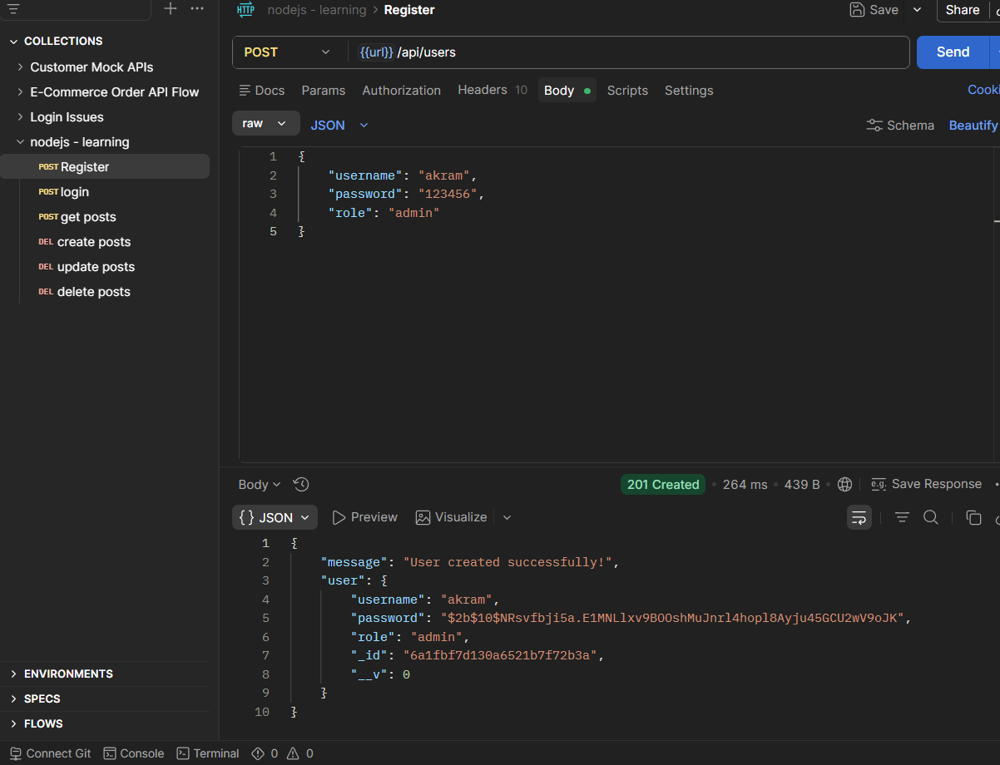
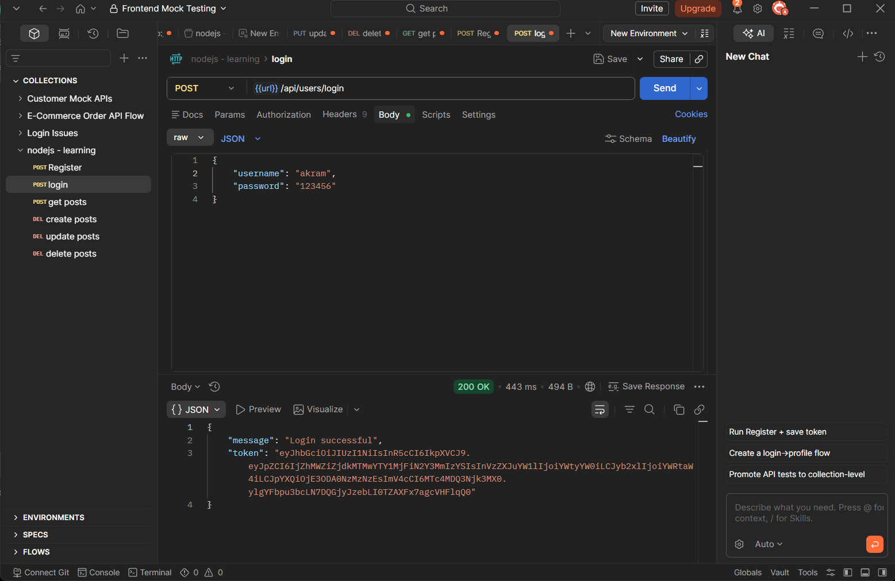
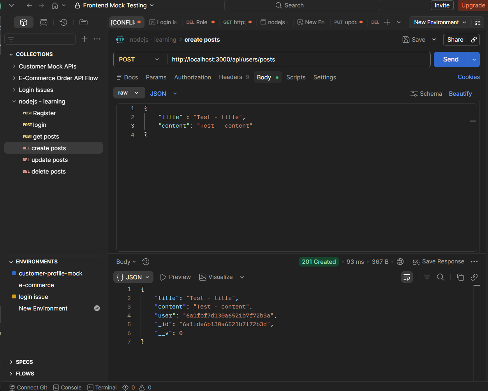
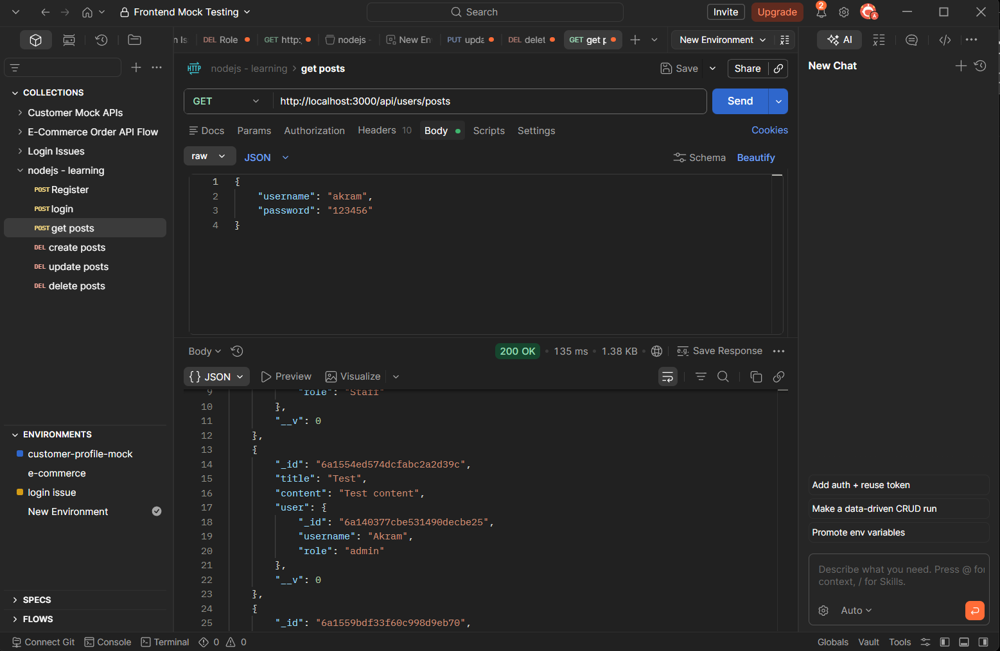
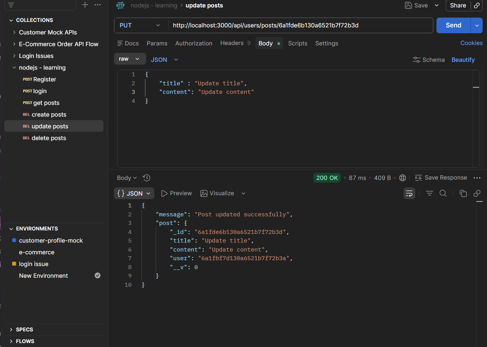
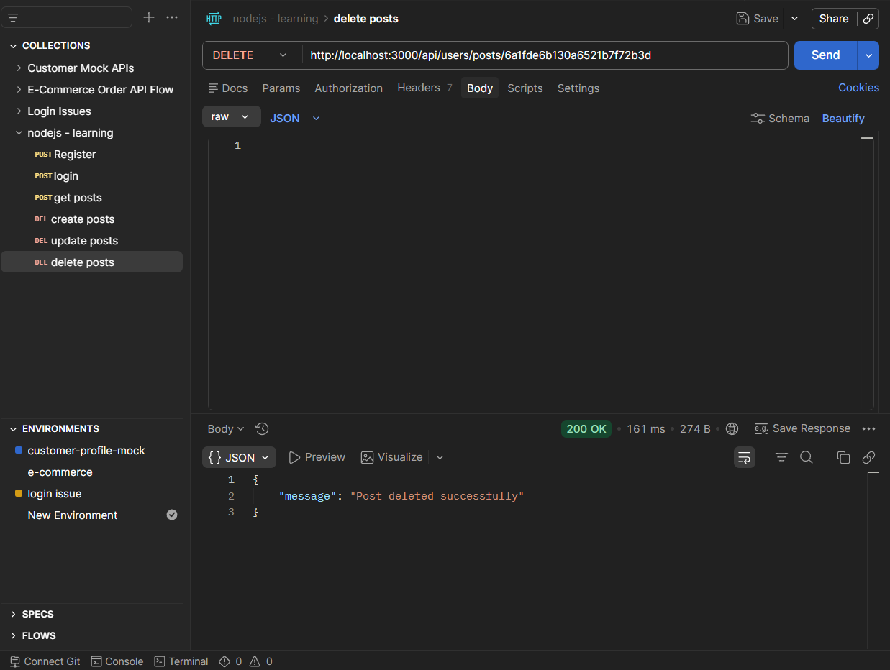

# Node.js Blog API

## Overview

A RESTful API developed using Node.js, Express.js, and MongoDB. The application provides user authentication and blog post management with secure JWT authorization.

## Features

### User Authentication
- User Registration
- User Login
- Password Hashing using bcrypt
- JWT Authentication

### Blog Management
- Create Post
- View Posts
- Update Own Posts
- Delete Own Posts

### Security
- Protected Routes
- Ownership Verification
- Role-Based Authorization

## Technologies Used

- Node.js
- Express.js
- MongoDB
- Mongoose
- JWT
- bcrypt
- Postman

## API Endpoints

### Authentication

| Method | Endpoint | Description |
|----------|----------|----------|
| POST | /register | Register user |
| POST | /login | Login user |

### Posts

| Method | Endpoint | Description |
|----------|----------|----------|
| GET | /posts | Get all posts |
| POST | /posts | Create post |
| PUT | /posts/:id | Update post |
| DELETE | /posts/:id | Delete post |

## Learning Outcomes

This project helped me understand:

- REST API Development
- Authentication and Authorization
- MongoDB Database Design
- Express Middleware
- JWT Security
- CRUD Operations
- API Testing with Postman

## Project Structure

```text
nodejs-blog-api
├── controllers
├── middleware
├── models
├── routes
├── server.js
└── package.json
```

## Skills Demonstrated

- REST API Development
- JWT Authentication
- MongoDB Database Integration
- Express Middleware
- CRUD Operations
- API Testing using Postman
- Error Handling
- Authorization & Access Control

## Screenshots

### User Registration


### User Login


### Create Post


### Get Posts


### Update Post


### Delete Post

```

## Author

Mohamad Akram
